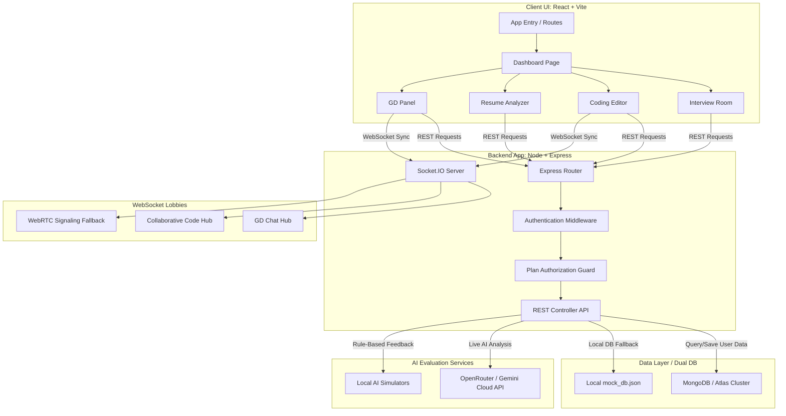
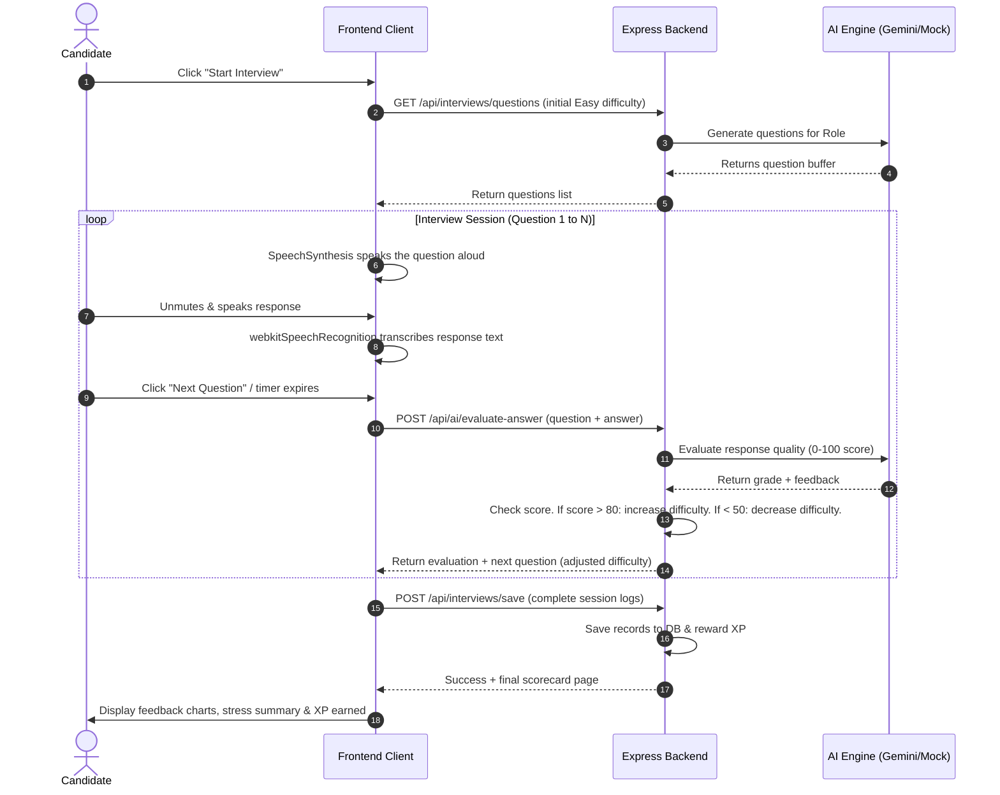
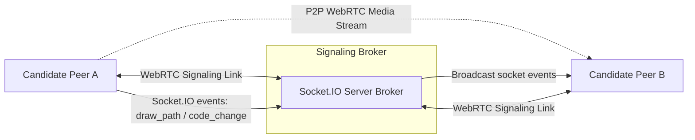

# System Architecture Diagrams
## Project: Ultimate AI Mock Interview Platform

This document presents the visual structure and sequence flows of the platform, built using Mermaid diagrams.

---

### 1. High-Level Component Architecture

This diagram illustrates how the frontend app, backend server, database layers, and external APIs communicate with each other.

---

### 2. Adaptive Voice AI Interview Sequence

This diagram shows the sequence of events during a voice mock interview session, including the dynamic difficulty adjustment loop.

---

### 3. Collaborative Lobbies (Socket.IO + WebRTC)

This diagram shows how real-time components (Virtual Group Discussions, pair coding, whiteboard sessions) communicate between candidate client instances.

