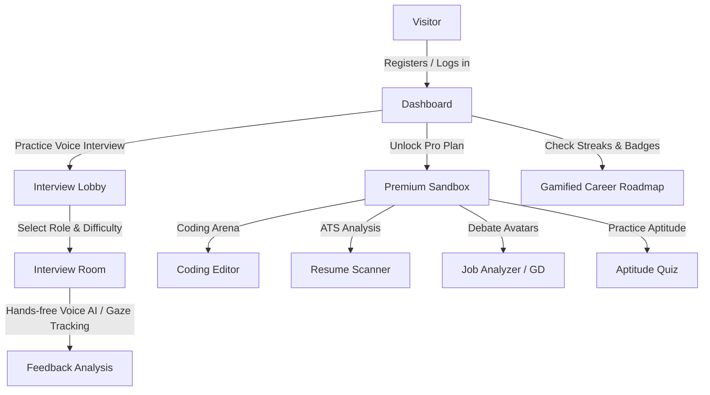

# Requirement Analysis Document (RAD)
## Project: Ultimate AI Mock Interview Platform

---

### 1. Introduction

#### 1.1 Purpose
This document provides a comprehensive requirement analysis for the **Ultimate AI Mock Interview Platform**. It details the functional, non-functional, and user experience requirements of the platform.

#### 1.2 Target Audience
- **Job Seekers / Students**: Preparing for technical, behavioral, aptitude, coding, or HR interviews.
- **Experienced Professionals**: Refining their coding skills or preparing for leadership roles (via Group Discussions or System Design simulations).
- **Administrators**: Monitoring users, adjusting subscription structures, and reviewing mock test metrics.

---

### 2. Functional Requirements

#### 2.1 Adaptive Voice AI Simulator
- **Voice Interactivity**: Must support hands-free audio interviews using standard Web Speech APIs (`webkitSpeechRecognition` and `SpeechSynthesis`).
- **Dynamic Difficulty Adjustment**: The difficulty of subsequent questions must scale (Easy $\leftrightarrow$ Hard) depending on the quality of the candidate's last answer.
- **Transcript Logging**: Speech input must be transcribed in real time and displayed visually.

#### 2.2 Stress & Attention Canvas Analyzer
- **Face Mesh Overlay**: Must render coordinate meshes on user webcam feeds using HTML5 canvas.
- **Stress Metrics**: Calculate a real-time stress percentage based on pupil movements and facial ticks.
- **Attention Tracking**: Measure eye-alignment limits to detect if a candidate is looking away from the screen for prolonged periods.

#### 2.3 Double-Panel Coding Sandbox
- **Algorithmic Editor**: Provide a fully functional code editor panel supporting multiple languages (JavaScript, Python, Java, C++).
- **Execution & Test Cases**: Run code against pre-configured and hidden test cases, reporting compiler outputs and execution timings.
- **AI Code Reviewer**: Provide deep AI reviews analyzing time complexity, optimization opportunities, and clean code suggestions.

#### 2.4 ATS Resume Scanner & Builder
- **Resume Builder**: An interactive editor allowing users to build a resume using a standardized layout.
- **ATS Scanner**: An automated keyword matching scanner that rates resume relevance against a target job description.
- **Scoring Breakdown**: Display score matrices (Formatting, Keyword density, Recency, Impact) with AI recommendations for improvement.

#### 2.5 Virtual Group Discussions (GD) Panel
- **AI Avatar Debate**: Render 4 distinct AI avatars (represented as dynamic SVG profiles/animations) that discuss a selected topic.
- **Turn-taking Logic**: Candidate can unmute and speak; the AI avatars must listen, comment, and adjust their conversation paths dynamically in response to candidate arguments.

#### 2.6 Aptitude Quiz Engine
- **Timed Evaluation**: A fully customizable quiz module featuring multiple-choice questions (Quant, Reasoning, Verbal).
- **Charts & Explanations**: Display visual reports of user performance (bar/pie charts using Recharts) and provide step-by-step math explanations.

#### 2.7 Gamification & Career Roadmaps
- **XP Economy**: Award XP points for completing interviews, daily coding tasks, and quizzes.
- **Streaks & Badges**: Retain an active day-streak tracker, awarding specialized SVG badges (e.g. "Coding Master") when milestones are reached.
- **SVG Career Roadmaps**: Interactive visual roadmaps guiding candidates step-by-step through standard tracks (e.g. Frontend Engineer, Backend Developer).

#### 2.8 Anti-Cheat Guard
- **Blur Strike Counter**: Blur event-handlers on the window must detect focus losses. Give a maximum of 3 strikes before automatically submitting the session.
- **Disable Interactivity**: Disable copy-pasting inside coding panels.

---

### 3. Non-Functional Requirements

#### 3.1 Availability & Reliability (Dual Mode)
- **Local Fallback**: If PostgreSQL or OpenRouter/Gemini API configurations are absent or offline, the system must seamlessly route operations to local in-memory stubs (gated by `ALLOW_DEMO_AUTH=true`) and run offline rule-based simulators.
- **Cloud Scale**: If PostgreSQL/OpenRouter endpoints are configured, utilize SQL-based persistence and live Large Language Models for response evaluations.

#### 3.2 Performance
- **Low Latency**: Socket.IO events (drawing coordinate syncs, coding changes, debate messages) must process within < 100ms.
- **Responsive Layout**: The UI must adjust fluidly to varying viewports (mobile, tablet, desktop) using custom CSS grids and Tailwind CSS.

#### 3.3 Security
- **Authentication**: Secure JWT token-based authentication for all protected endpoints.
- **Route Guards**: Client-side React Router route guards checking JWT status and premium user authorization checks (`PlanGate` component).

---

### 4. User Flow Diagrams

