# UI Showcase & Wireframes
## Project: Ultimate AI Mock Interview Platform

This document displays screenshots of the application pages captured from the running environment, as well as the GitHub repository.

---

### 1. Landing Page

The landing page features a premium, modern dark mode layout with custom gradients, highlighting the core modules and key features of the platform.

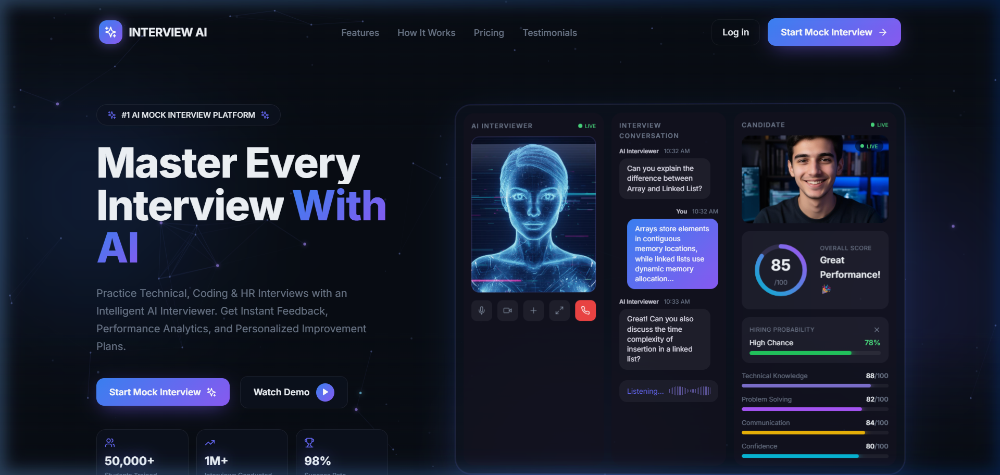

---

### 2. Registration Page

The registration interface allows candidates to sign up for the platform by entering their academic details (college, branch, graduation year) to personalize their roadmap recommendations.

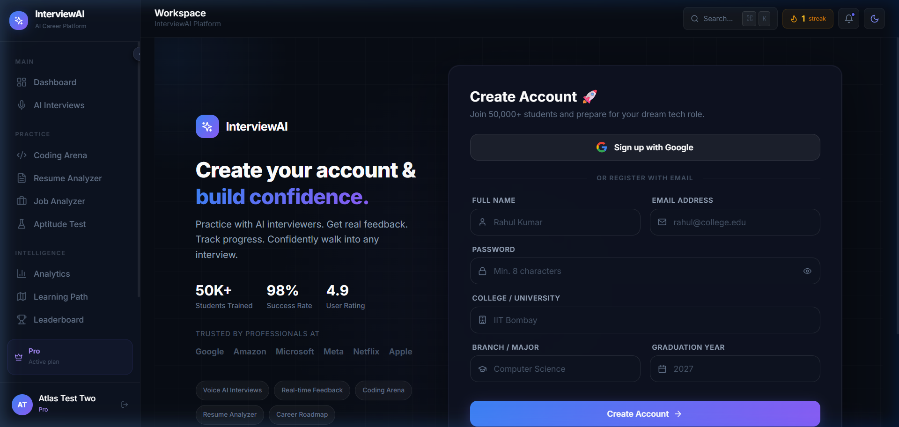

---

### 3. User Dashboard

The Dashboard provides an overview of the user's progress, streak metrics, total XP earned, active challenges, and quick links to practice rooms.

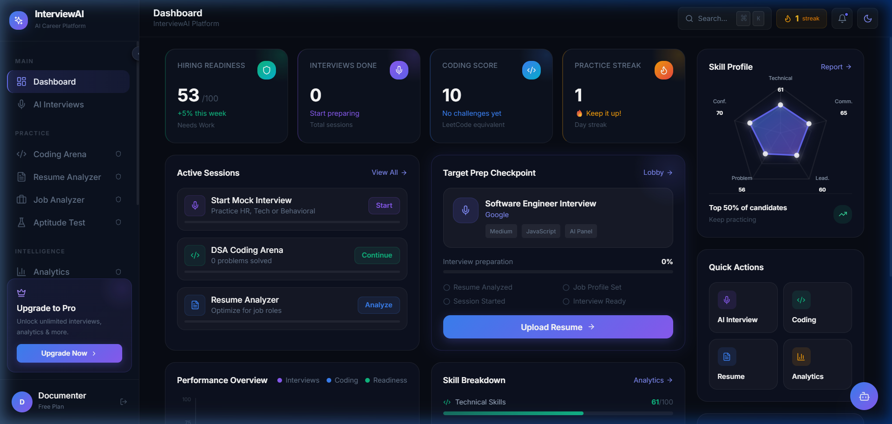

---

### 4. AI Interviews Lobby

The Interview Lobby allows candidates to configure custom mock interviews. It supports setting the role (e.g. Software Engineer), difficulty level, interview type, and language preference.

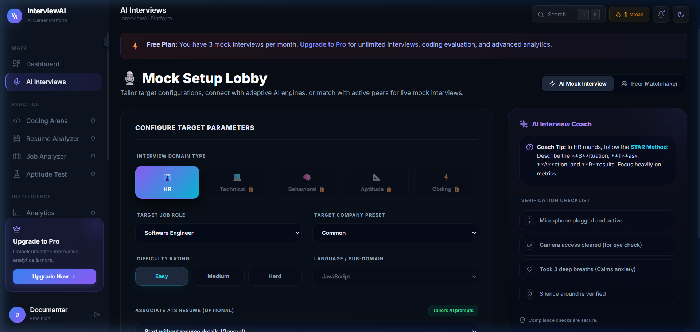

---

### 5. Coding Arena

A double-panel interactive coding sandbox. Features a full-fledged algorithmic editor on the left and compile/run execution test indicators on the right.

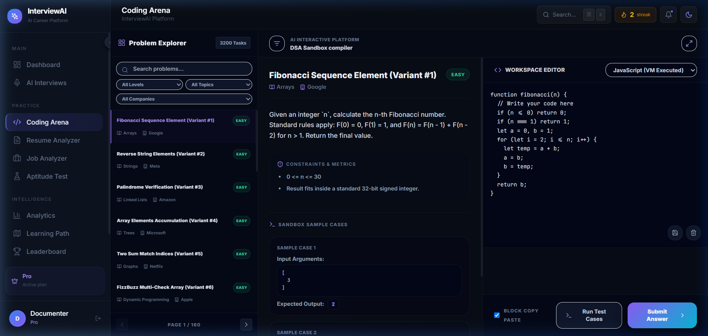

---

### 6. ATS Resume Analyzer

An ATS compliance check tool where users can upload resumes to match against specific job descriptions. It scores the resume and provides direct keyword highlights and change suggestions.

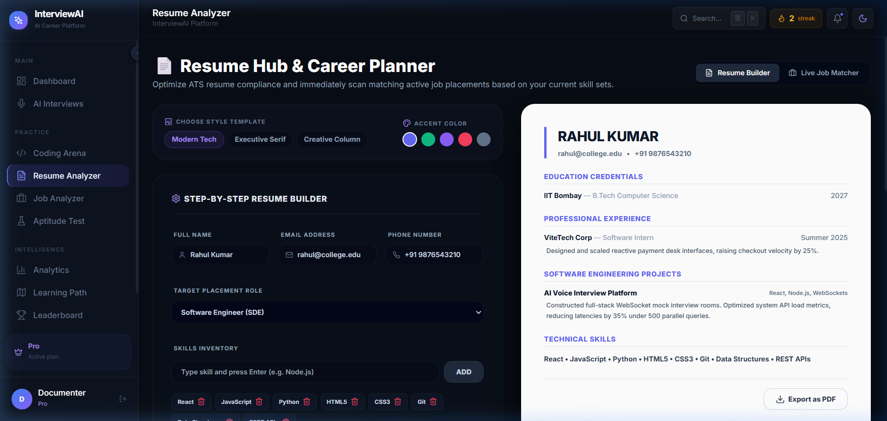

---

### 7. Group Discussion Debate Panel

An interactive roundtable simulator. Candidates can discuss/debate hot tech topics alongside four speaking AI avatars that adjust their conversation flows in real-time.

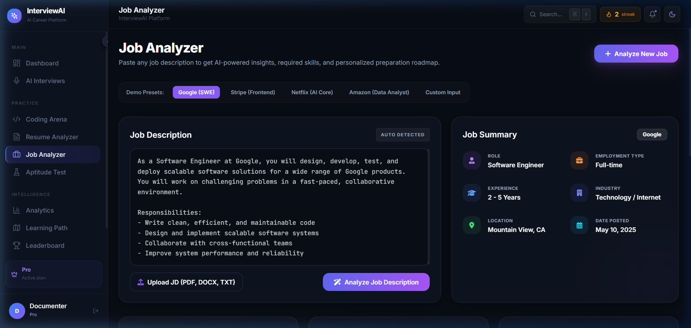

---

### 8. Learning Roadmap

An interactive SVG-based career roadmap guiding candidates step-by-step through front-end, back-end, ML, and DevOps engineering preparation tracks.

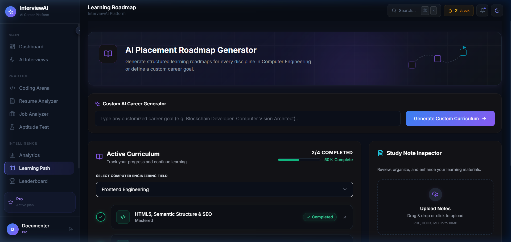

---

### 9. Aptitude Quiz Engine

A timed test environment containing reasoning, logical, and verbal multiple-choice questions with step-by-step explanations and progress tracking.

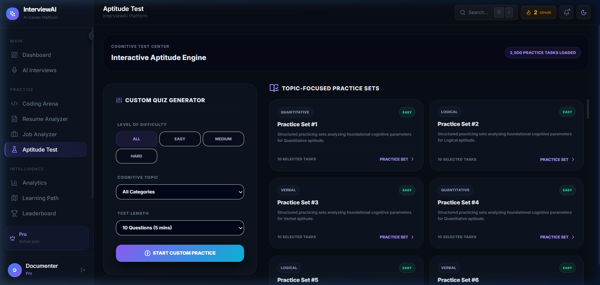

---

### 10. Analytics & Feedback Analysis

Displays comprehensive scorecard reviews from past interviews, detailing stress scores, eye contact percentages, words-per-minute metrics, filler word counts, and custom flashcards.

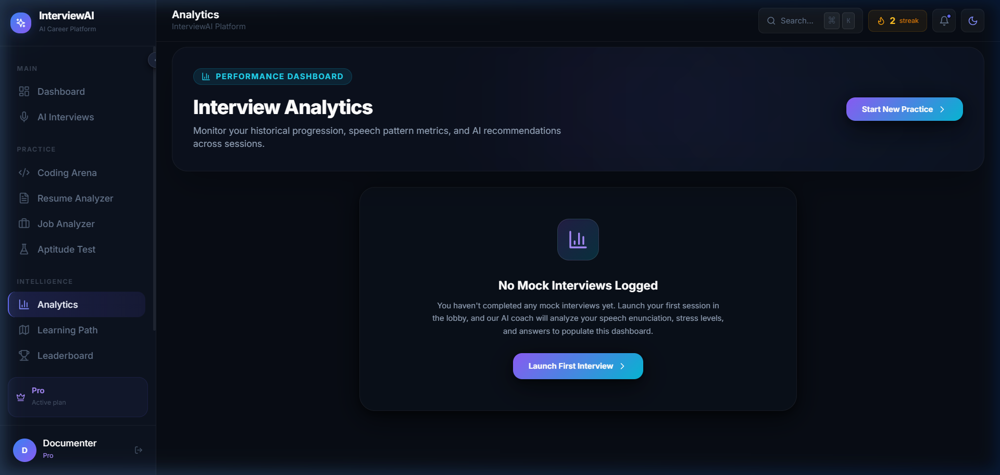

---

### 11. Leaderboard

Displays top-performing candidates across the platform based on overall XP accumulated, streaks, and badges earned.

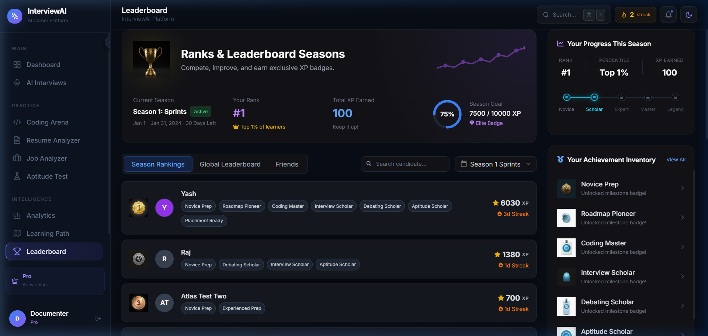

---

### 12. Settings Panel

Allows candidates to edit their profiles, customize accessibility fonts, toggle visual theme configurations, change passwords, and manage plan tiers.

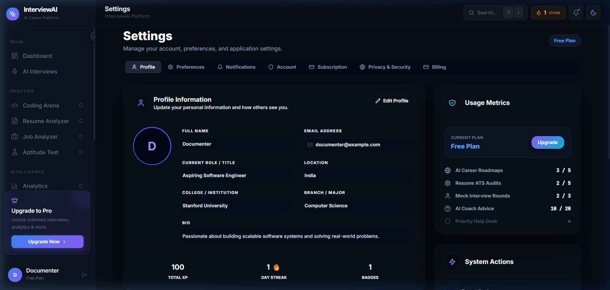

---

### 13. GitHub Repository

The official project repository hosting the source files, folder structure, and documentation.

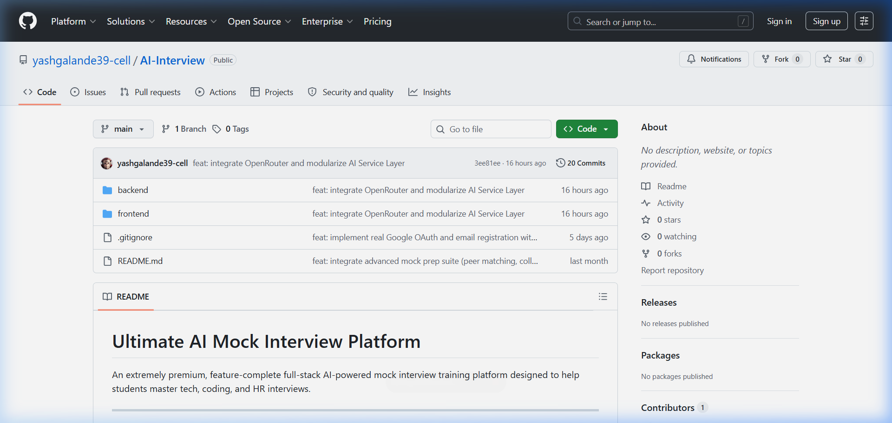
